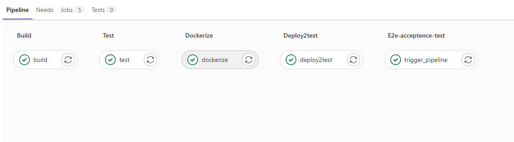
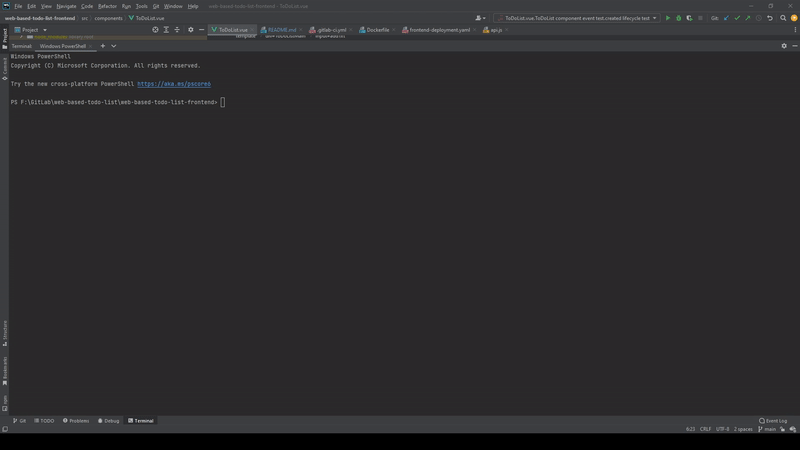

# Web Based ToDo List Application

## Tech Stack

<ol>
<li> Vue (frontend) 
    <ol>
        <li>axios (API calls)</li>
        <li>unit tests (vue-test-utils)</li>
        <li>e2e tests (puppeteer cucumber)</li>
        <li>consumer driven contract test and publisher broker</li>
    </ol>
</li>

<li>Nginx (Web server)</li>

<li>Docker</li>
<li>Gitlab CI/CD Pipeline(CI)</li>
<li>Google Cloud Kubernetes</li>
</ol>

## Pipeline automation

## Unit Test

## URL

http://34.135.153.228/

